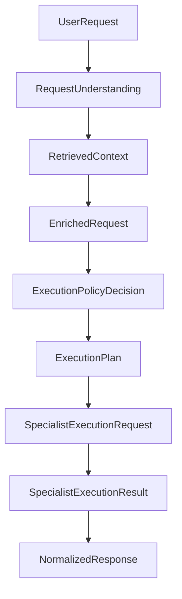
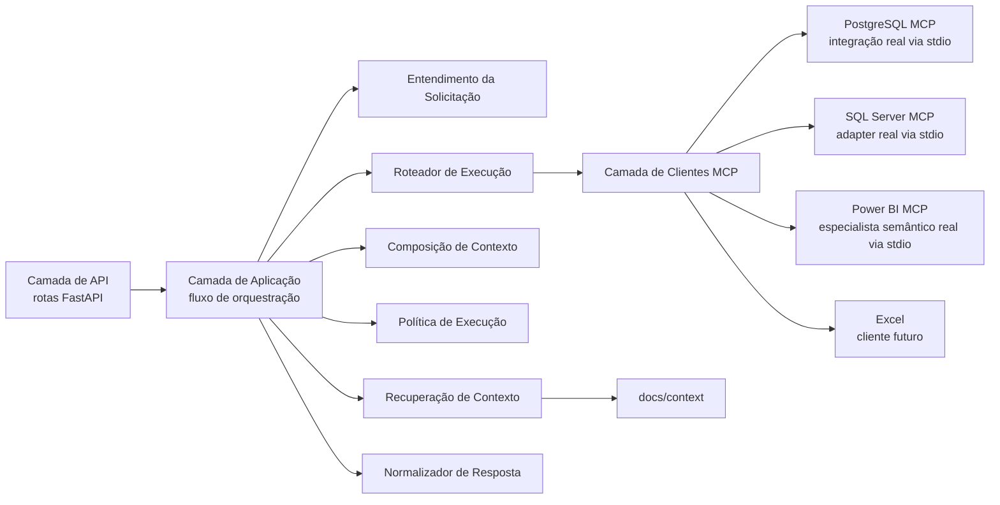
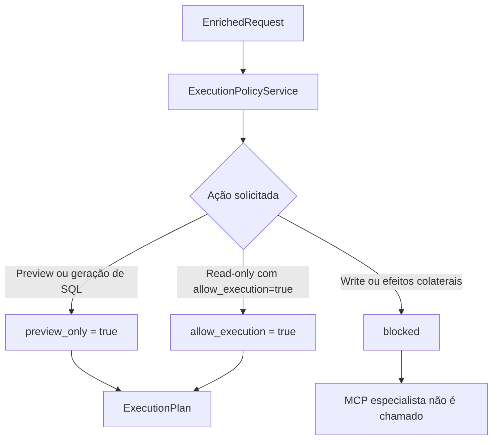
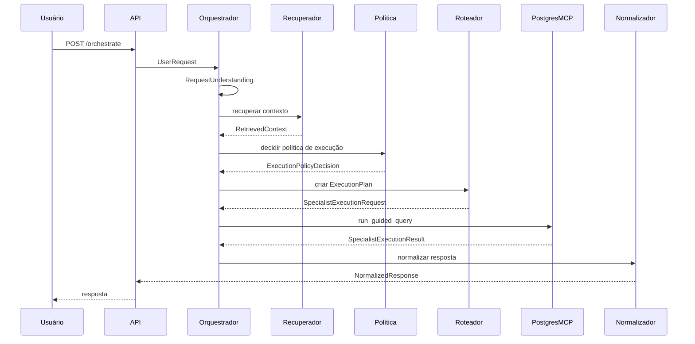
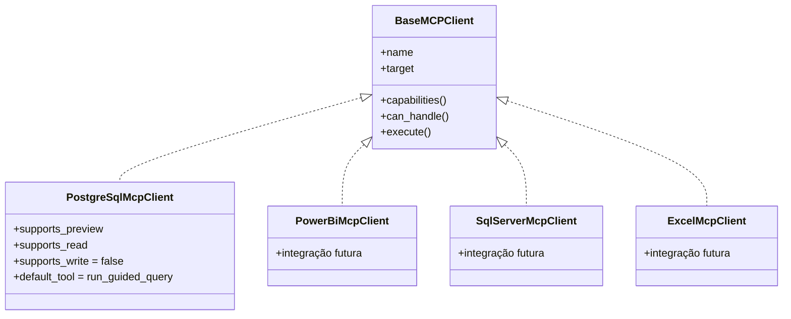
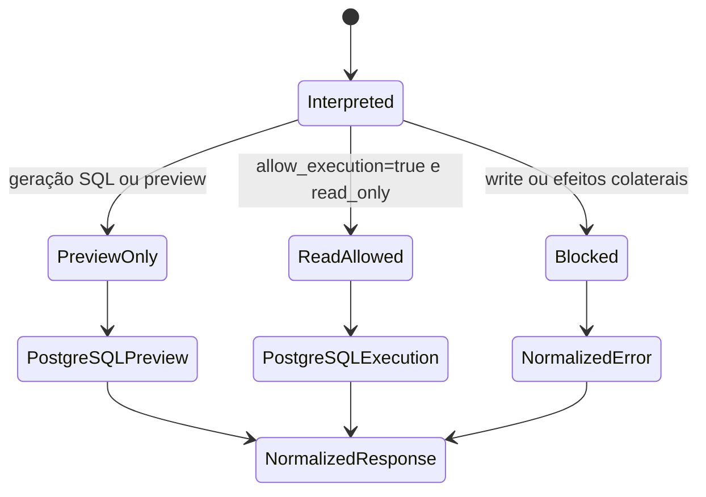

# MCP Orchestrator - Status da Implementação

## Visão Geral

O **MCP Orchestrator** evoluiu de uma arquitetura conceitual para uma fundação executável, modular e tipada.

O sistema atua como um **middleware contextual de orquestração para servidores MCP especializados**. Ele não é um roteador simples. Antes de chamar qualquer MCP especialista, o orquestrador interpreta a solicitação, recupera contexto local, compõe uma requisição enriquecida, aplica governança de execução, cria um plano de execução e só então chama o cliente especialista adequado.

Atualmente, PostgreSQL, SQL Server e Power BI possuem adapters reais de clientes MCP por meio de `stdio`. O PostgreSQL MCP e o Power BI Modeling MCP estão presentes no repositório; o SQL Server MCP depende de um servidor local futuro em `mcps/`.

## Fluxo Atual da Orquestração



Esse fluxo garante que nenhum MCP especialista receba diretamente a solicitação bruta do usuário.

## O Que Foi Implementado

### Fase 0 - Fundação Executável

A primeira fase de implementação criou a fundação executável do orquestrador:

- estrutura modular do projeto
- contratos Pydantic tipados
- aplicação FastAPI
- `GET /health`
- `POST /orchestrate`
- camada inicial de entendimento da solicitação
- recuperação de contexto local a partir de `docs/context`
- composição de requisição enriquecida
- roteamento para MCP especialista
- contrato de resposta normalizada
- integração real com PostgreSQL MCP por meio de `stdio`
- testes automatizados para o fluxo principal

A estrutura de contexto local é:

```text
docs/context/
  business_rules/
  schemas/
  technical_docs/
  examples/
  playbooks/
```

### Fase 1 - Governança de Execução e Rastreabilidade

A segunda etapa de implementação adicionou governança explícita de execução, entendimento mais forte da solicitação, trace de orquestração tipado e capacidades declaradas dos clientes MCP.

Agora, o orquestrador toma uma decisão explícita de política antes de chamar qualquer MCP especialista.

### Fase 2 - Orquestração Relacional Multi-Backend

A terceira etapa adicionou o SQL Server como o segundo adapter real de cliente MCP especialista.

O objetivo da Fase 2 foi provar que os contratos de orquestração não são específicos de PostgreSQL. PostgreSQL e SQL Server agora seguem o mesmo modelo relacional:

- seleção de backend por entendimento da solicitação
- decisão explícita de política antes da execução
- comportamento preview-first por padrão
- opt-in explícito para leitura quando permitido pela política
- bloqueio de escrita e efeitos colaterais antes da chamada ao MCP
- detalhes de transporte isolados em `debug`

### Fase 3 - Especialista Semântico Power BI

A quarta etapa adicionou o Power BI como especialista MCP real para fluxos semânticos e de modelagem.

O objetivo da Fase 3 foi provar que o orquestrador suporta workflows não relacionais sem redesenhar o núcleo:

- inspeção de modelos semânticos
- listagem de tabelas e medidas
- preview ou geração segura de DAX
- bloqueio padrão de refresh, escrita de modelo e efeitos colaterais
- transporte Power BI isolado nos campos `debug`

## Arquitetura Modular



A camada de API não contém lógica de negócio. Ela valida a entrada e delega para o serviço de orquestração.

## Contratos Principais

O orquestrador usa contratos explícitos para cada etapa do fluxo:

- `UserRequest`
- `RequestUnderstanding`
- `RetrievedContext`
- `EnrichedRequest`
- `ExecutionPolicyDecision`
- `ExecutionPlan`
- `SpecialistExecutionRequest`
- `SpecialistExecutionResult`
- `NormalizedResponse`
- `OrchestrationTrace`
- `McpClientCapability`

Esses contratos tornam o sistema mais fácil de testar, inspecionar e estender.

## Integração com PostgreSQL MCP

O PostgreSQL é a primeira integração real com um MCP especialista.

O servidor MCP local é descoberto a partir de:

```text
mcps/postgressql-mcp-master/server.py
```

O `PostgreSqlMcpClient` chama o servidor PostgreSQL MCP por meio do transporte MCP `stdio`.

Por padrão, a orquestração chama:

```text
run_guided_query
```

com:

```json
{
  "auto_execute": false,
  "limit": 100
}
```

Isso significa que o comportamento padrão é **preview-first**: o sistema prepara uma prévia segura de SQL em vez de executar consultas automaticamente no banco de dados.

## Integração com SQL Server MCP

O SQL Server agora possui um adapter real de cliente MCP usando o mesmo contrato do PostgreSQL.

O adapter espera que um servidor SQL Server MCP local seja adicionado futuramente em uma pasta como:

```text
mcps/sql-server-mcp/
mcps/sqlserver-mcp/
mcps/mssql-mcp/
```

Cada pasta deve expor um `server.py` para execução via `stdio`.

Enquanto o servidor SQL Server MCP não existir localmente, o client retorna um erro controlado:

```text
MCP server not found: sql_server
```

O contrato esperado para MCPs relacionais inclui:

- descoberta de schema
- listagem de tabelas
- descrição de tabela
- preview seguro de query
- execução read-only opcional quando a política permite
- bloqueio de escrita e efeitos colaterais por padrão

## Política de Execução

A Fase 1 introduziu uma camada explícita de governança de execução.



A decisão de política inclui:

- `preview_only`
- `read_only`
- `write`
- `side_effects`
- `requires_confirmation`
- `allow_execution`
- `blocked_reason`
- `safety_level`
- `risk_level`

Solicitações de escrita e solicitações com efeitos colaterais são bloqueadas antes de chegar a um MCP especialista.

## Entendimento Mais Forte da Solicitação

O contrato `RequestUnderstanding` foi expandido para capturar mais detalhes sobre a solicitação do usuário:

- `intent`
- `domain`
- `task_type`
- `requested_action`
- `target_preference`
- `candidate_mcps`
- `constraints`
- `ambiguities`
- `confidence`
- `risk_level`
- `reasoning_summary`

A implementação atual ainda é baseada em regras, mas o contrato já está preparado para um futuro interpretador baseado em LLM sem alterar o fluxo de orquestração posterior.

## Trace de Orquestração

O orquestrador agora cria um trace tipado para cada solicitação.



O trace captura:

- id da solicitação
- timestamps por etapa
- MCPs alvo selecionados
- fontes de contexto recuperadas
- decisão de política
- avisos
- informações de fallback
- notas de debug

Ele é retornado em:

```text
NormalizedResponse.debug.orchestration_trace
```

Detalhes de baixo nível do transporte MCP ficam dentro dos campos `debug` e não são promovidos para os campos principais da resposta.

## Capacidades dos Clientes MCP

Clientes especialistas agora expõem capacidades tipadas.



Cada cliente pode declarar:

- MCP alvo
- ferramentas suportadas
- suporte a preview
- suporte a leitura
- suporte a escrita
- suporte a efeitos colaterais
- ferramenta padrão

Isso prepara a arquitetura para futuras expansões de Power BI, SQL Server, PostgreSQL e Excel sem alterar o núcleo de orquestração.

## Modelo de Segurança Atual



Padrões atuais:

- PostgreSQL não executa consultas automaticamente no banco de dados.
- Geração de SQL usa modo preview.
- Solicitações de escrita são bloqueadas.
- Solicitações com efeitos colaterais são bloqueadas.
- Execução read-only exige opt-in explícito via metadata.

Exemplo de opt-in explícito:

```json
{
  "message": "Read rows from PostgreSQL sales_orders.",
  "domain_hint": "postgresql",
  "tags": ["sales", "postgresql"],
  "metadata": {
    "allow_execution": true
  }
}
```

## Testes

A suíte de testes cobre:

- contratos Pydantic
- recuperação de contexto local
- entendimento da solicitação
- decisões de política de execução
- roteamento
- capacidades dos clientes MCP
- comportamento preview-first do PostgreSQL
- trace de orquestração
- endpoints FastAPI

Resultado atual após a Fase 3:

```text
60 testes passando
```

## Commits Criados

Commits regulares foram criados durante a implementação:

```text
9d254db Add execution governance foundation
1a58a83 Document and test execution governance
e7b00ff Add SQL Server relational MCP client
```

## Estado Atual do Projeto

O projeto agora possui:

- fundação executável de orquestração
- fluxo tipado de ponta a ponta
- integração real com PostgreSQL MCP
- adapter real para SQL Server MCP via `stdio`
- adapter real para Power BI MCP via `stdio`
- recuperação de contexto local
- governança explícita de execução
- rastreabilidade tipada
- modelo extensível de capacidades dos clientes MCP
- testes cobrindo o comportamento central

## Próximos Passos Para a Próxima Fase

Próximos passos recomendados:

1. Adicionar um fluxo de confirmação para ações bloqueadas ou sensíveis.
2. Persistir traces e decisões de política em um storage auditável.
3. Substituir o interpretador heurístico por um interpretador baseado em LLM.
4. Adicionar o servidor SQL Server MCP local e validar integração fim a fim.
5. Validar o Power BI MCP contra um modelo semântico real em Power BI Desktop, Fabric ou PBIP.
6. Melhorar a recuperação local com embeddings.
7. Adicionar logs estruturados e métricas mais ricas.
8. Adicionar testes de integração controlados contra bancos PostgreSQL, SQL Server e modelos Power BI reais.

A arquitetura central está pronta para essas adições sem reescrever o pipeline de orquestração.
