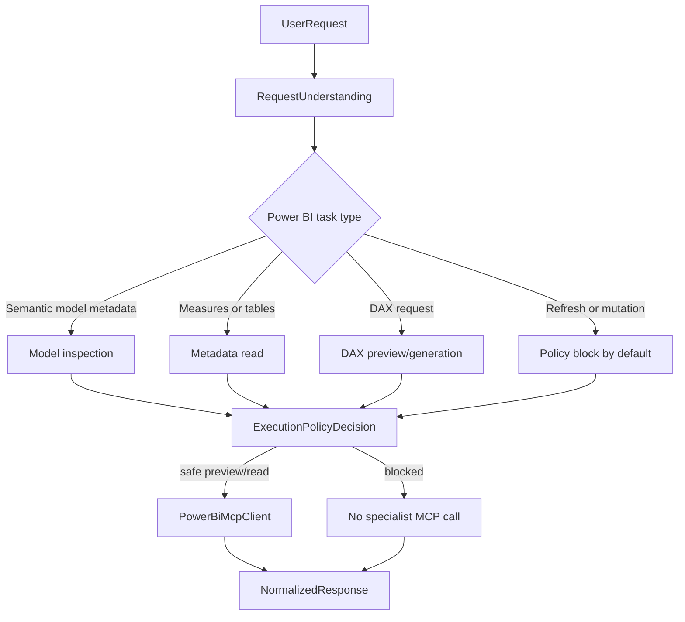
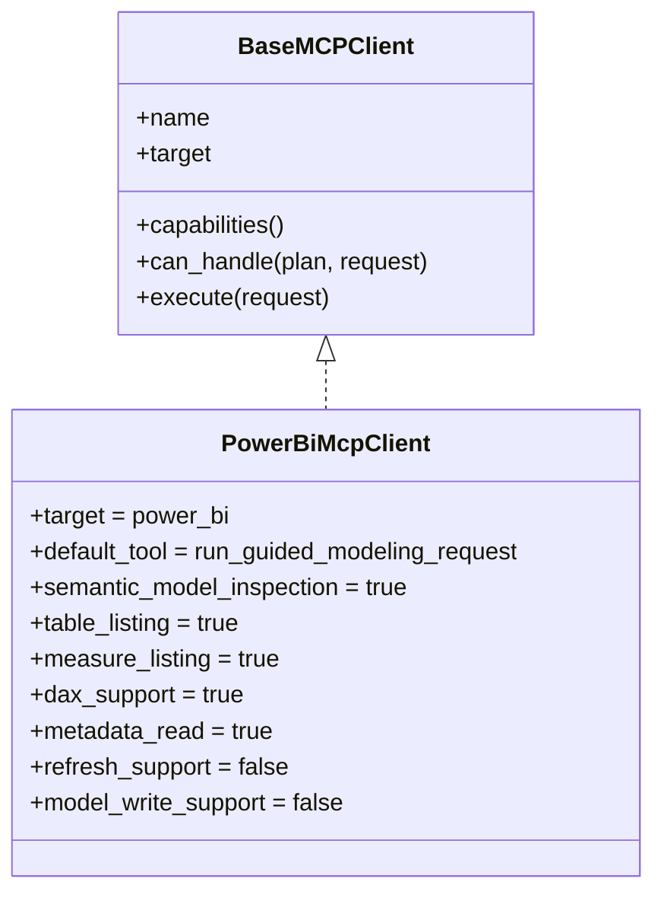

# Phase 3 - Power BI Semantic Specialist

## Summary

Phase 3 adds Power BI as a real semantic/modeling specialist MCP client while preserving the orchestration contracts already validated with PostgreSQL and SQL Server.

The goal is to prove that the orchestrator can support non-relational semantic workflows without redesigning the core flow:

```text
UserRequest
  -> RequestUnderstanding
  -> RetrievedContext
  -> EnrichedRequest
  -> ExecutionPolicyDecision
  -> ExecutionPlan
  -> SpecialistExecutionRequest
  -> SpecialistExecutionResult
  -> NormalizedResponse
```

Power BI is not modeled as a relational database. It is treated as a semantic/modeling specialist with its own capabilities.

## Semantic Backend Flow



## Power BI Client Capabilities



The capability model now supports semantic flags without breaking relational clients:

- `semantic_model_inspection`
- `table_listing`
- `measure_listing`
- `dax_support`
- `metadata_read`
- `refresh_support`
- `model_write_support`
- `side_effect_support`

## Routing Rules

Power BI routing uses:

- `domain_hint`
- `target_preference`
- `candidate_mcps`
- `requested_action`
- client capabilities
- execution policy

Current behavior:

- Power BI semantic model requests route to `PowerBiMcpClient`
- DAX requests route to `PowerBiMcpClient`
- metadata, table, and measure listing requests route to `PowerBiMcpClient`
- refresh and model mutation requests are blocked before specialist execution
- relational SQL requests continue routing to PostgreSQL or SQL Server

## Policy Treatment

Safe by default:

- semantic model inspection
- metadata reads
- table listing
- measure listing
- DAX preview/generation

Blocked by default:

- refresh operations
- model mutation
- table/measure/relationship writes
- deployment or publish-like side effects

Blocked requests return a normalized policy result and do not call the Power BI MCP server.

## Power BI MCP Setup

The Power BI Modeling MCP package is managed locally under:

```text
mcps/powerbi-modeling-mcp
```

The local catalog discovers it as:

```text
power_bi
```

The package requires Node.js and a valid Power BI Modeling MCP setup. Live operations require a connection to one of:

- Power BI Desktop semantic model
- Fabric workspace semantic model
- PBIP/TMDL semantic model files

The orchestrator does not import Power BI server code. It calls the local MCP server through stdio.

## Debug And Response Shape

`NormalizedResponse` stays stable.

Power BI specialist results may include:

- model metadata summaries
- table lists
- measure lists
- suggested DAX
- safe previews

Transport details stay under the specialist result `debug` field.

## Test Coverage

Phase 3 adds tests for:

- Power BI capabilities
- semantic model routing
- DAX routing
- guided semantic request payloads
- Power BI tool error mapping
- missing Power BI MCP server handling
- policy blocking refresh before specialist execution
- regression coverage for PostgreSQL and SQL Server routing
